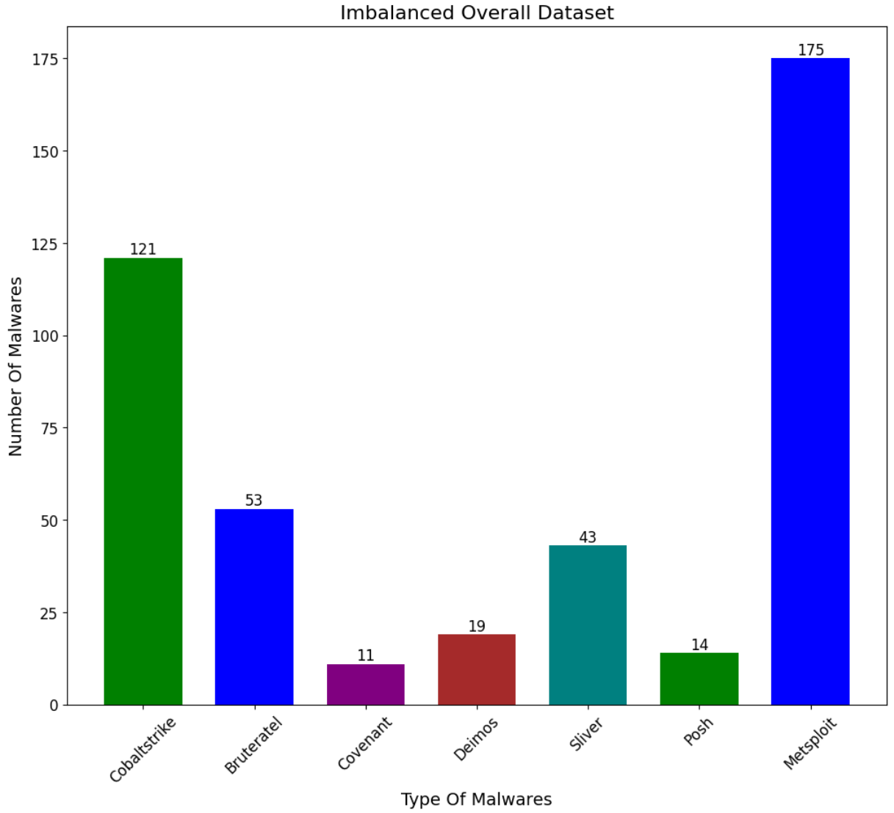
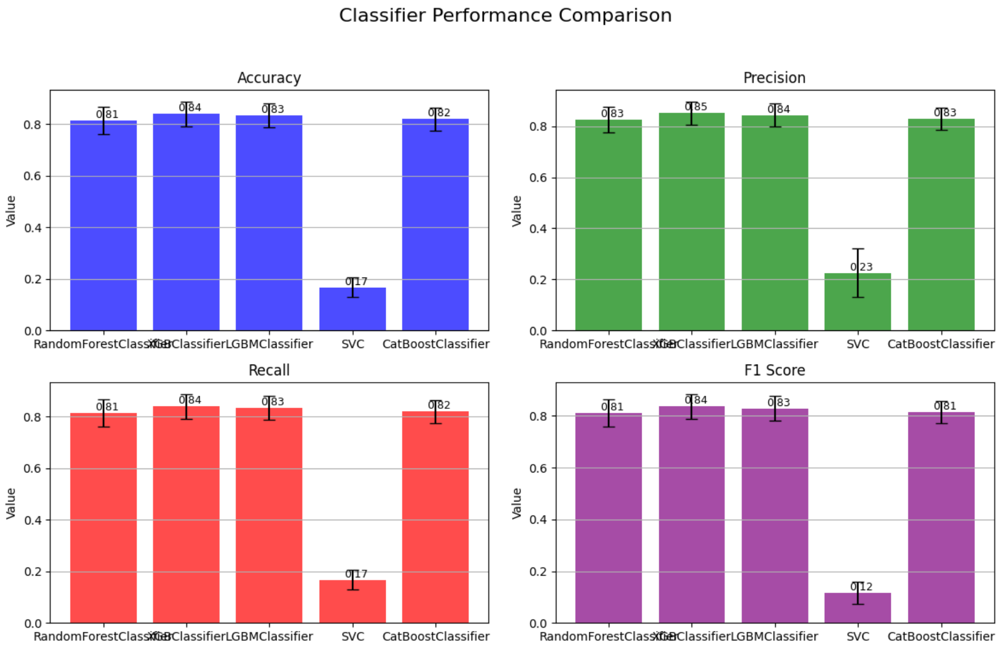

# ML Tool for Cross-Platform Binary Analysis


## Project Description
This project aims to create a machine learning model that can classify binary files into appropriate Command and Control (C2) types. The classification relies on five key features: Yara lists, TTP (Tactics, Techniques, and Procedures) lists, Windows API lists, and the number of nodes and edges in the Control Flow Graph extracted from binary files using Ghidra. Various classifiers such as Random Forest, XGBoost, LightGBM, Support Vector Classifier (SVC), CatBoost, etc., are trained using these five pieces of information. The project evaluates the performance of these classifiers to determine their effectiveness in classifying binary files.

## Project Duration
2023.03 ~ 2023.11

## Requirements
```
$ pip install tqdm
$ pip install catboost
```

## Overall Task
- [1. System Programming Recap](https://github.com/c-jinwoo/skku_grad_proj/tree/master/1.%20System%20Programming%20Recap)
- [2. API : Shodan, Censys](https://github.com/c-jinwoo/skku_grad_proj/tree/master/2.%20API)
- [3. Data Crawling](https://github.com/c-jinwoo/skku_grad_proj/tree/master/3.%20Dataset%20Crawling)
- [4. CFG extraction](https://github.com/c-jinwoo/skku_grad_proj/tree/master/4.%20CFG)
- [5. Ghidra : Windows API](https://github.com/c-jinwoo/skku_grad_proj/tree/master/5.%20Windows%20API)
- [6. CAPA : TTP list](https://github.com/c-jinwoo/skku_grad_proj/tree/master/6.%20TTP)
- [7. YARA list](https://github.com/c-jinwoo/skku_grad_proj/tree/master/7.%20YARA)
- [8. Number of Nodes and Edges](https://github.com/c-jinwoo/skku_grad_proj/tree/master/8.%20Dataset%20Organizing)
- [9. Dataset Proprocessing](https://github.com/c-jinwoo/skku_grad_proj/tree/master/9.%20Word%20Embedding)
- [10. Machine Learning](https://github.com/c-jinwoo/skku_grad_proj/blob/master/c2_ml_final.ipynb)

## Dataset
There are a total of 436 binary files, and they belong to seven different C2 types. These C2 types are as follows: Cobaltstrike, Metasploit, Covenant, Bruteratel, Deimos, Sliver, and Posh. Please refer to the following table.

| C2 Type       | Number of Files |
|---------------|-----------------|
| Cobaltstrike  | 121             |
| Bruteratel    | 53              |
| Covenant      | 11              |
| Deimos        | 19              |
| Sliver        | 43              |
| Posh          | 14              |
| Metasploit    | 175             |



## Evaluation

